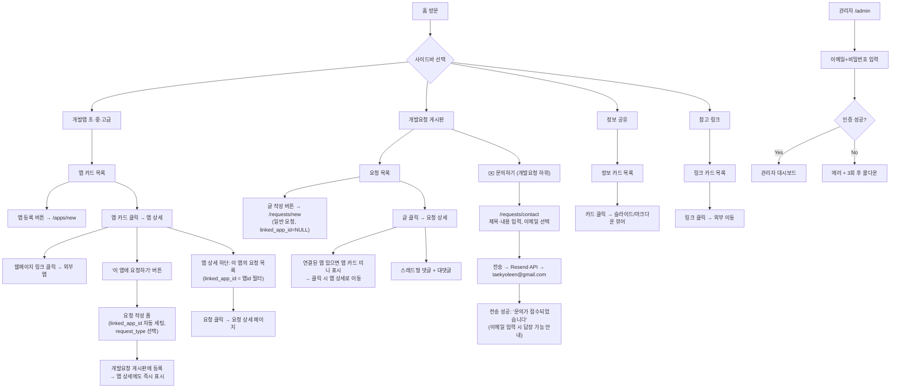

# 비개발자의 개발실 — 웹 개발 설계서

> **기술 스택**: Next.js 15 (App Router) · TweakCN · Supabase  
> **작성일**: 2025년  
> **버전**: v1.7 (누구나 등록 / 스레드 댓글 / 서브에이전트 분리 / 앱 섹션 검색·필터 / 앱↔요청 양방향 연결 / AI 글 다듬기 + 관리자 API 설정 / 관리자 이메일 문의 / **관리자 Supabase Auth 전환 / Magic Link 소유권 인증 / 홈 히어로 섹션 / 다크모드 / 댓글 depth 2 / vibe_tool enum / 모바일 햄버거 / 페이지네이션 / OG 태그 / SSRF 방어 / api_account 제거 / vc_admin_sessions 제거**)  
> **목적**: Claude Code 구현 참조용 계획서

---

## 1. 프로젝트 컨텍스트

### 목적
**비개발자의 개발실**은 바이브 코딩(Vibe Coding)으로 앱을 만든 비개발자들이 자신의 앱을 공유하고, 개발 과정에서 사용한 프롬프트·도구·경험을 커뮤니티와 나누는 비상업적 플랫폼입니다.

### 공지 문구 (헤더 배너)
> 이 공간은 비개발자가 앱을 개발하는 데 도움을 주고, 이를 발전하고자 하는 목적으로 **비상업적으로 운영**됩니다.  
> 상업적 또는 다수의 사용 등 사용빈도가 높을 경우 별도의 협의가 필요합니다.  
> 특히 API KEY를 사용하는 앱의 경우 제한이 있을 수 있고, 필요한 경우 사용자의 API Key를 요청하도록 변경될 수 있습니다.

### 대상 사용자
- **일반 방문자**: 누구나 — 앱 등록, 정보 공유 글 작성, 링크 추가, 개발 요청, 댓글 작성 가능
- **관리자**: 스팸·부적절 콘텐츠 삭제, 상태 변경, 전체 CRUD 권한 보유

### 핵심 기능 요약
| 섹션 | 누구나 가능 | 관리자 전용 |
|------|-----------|-----------|
| 개발앱 (초·중·고급) | 앱 카드 등록, 조회, 검색·필터, 앱 카드에서 요청 직접 제출, **AI 글 다듬기** | 수정, 삭제, 숨김 처리 |
| 개발요청 게시판 | 요청 글 작성, 스레드 댓글, 연결된 앱 표시 | 상태 변경, 삭제 |
| 정보 공유 | 가이드 카드 작성 (마크다운/슬라이드) | 수정, 삭제, 순서 조정 |
| 참고 링크 | 링크 추가 | 수정, 삭제, 순서 조정 |
| **관리자 설정** | — | **API 기능별 ON/OFF, 이메일·비밀번호 계정 관리** |

### 제약조건
- 로그인/회원가입 없음 (v1.0) — **단, Supabase Auth 인프라 사전 구성 필요 (관리자 계정 + Magic Link용)**
- **콘텐츠 등록**: 누구나 자유롭게 가능 (닉네임 + 선택적 이메일 입력)
- **등록자 수정**: 이메일 입력 시 Magic Link 인증 후 직접 수정 가능 — 이메일 미입력 시 수정 불가
- **수정·삭제·숨김**: 관리자 전용 (Supabase Auth 세션 방식, v1.0)
- **닉네임**: 표시 목적 전용, 중복/사칭 허용 (v1.0) — 공지 배너에 안내 문구 포함
- **AI 글 다듬기**: 관리자가 ON/OFF 가능 — OFF 시 버튼 비활성화 또는 미표시
- **스팸 방지**: 단순 rate limiting (IP 기반, 서버 사이드) — 추후 회원제로 강화 예정
- Next.js 15 App Router
- Vercel 배포 대상
- 성능 목표: Lighthouse ≥ 90 (모바일 포함)

### 용어 정의
| 용어 | 설명 |
|------|------|
| 바이브 코딩 (Vibe Coding) | AI 도구를 활용하여 비개발자가 앱을 만드는 개발 방식 |
| 초급 앱 | 단순 UI, API 없이 동작하는 앱 |
| 중급 앱 | 외부 API 또는 DB 연동, 약간의 로직 포함 |
| 고급 앱 | 인증, 실시간 기능, 복잡한 비즈니스 로직 포함 |
| 개발요청 | 커뮤니티 구성원이 원하는 앱 또는 기능을 요청하는 게시글 |

---

## 2. 페이지 목록 및 사용자 흐름

### 페이지 목록

| 경로 | 페이지명 | 설명 | 인증 필요 |
|------|--------|------|---------|
| `/` | 홈 (랜딩) | 사이트 소개 + 공지 배너 + 최신 앱 하이라이트 | ❌ |
| `/apps/beginner` | 개발앱 (초급) | 초급 앱 카드 목록 + 검색창 + 필터 칩 | ❌ |
| `/apps/intermediate` | 개발앱 (중급) | 중급 앱 카드 목록 + 검색창 + 필터 칩 | ❌ |
| `/apps/advanced` | 개발앱 (고급) | 고급 앱 카드 목록 + 검색창 + 필터 칩 | ❌ |
| `/apps/[id]` | 앱 상세 | 앱 이름/설명/링크/프롬프트/마크다운 등 상세 정보 | ❌ |
| `/apps/new` | 앱 등록 | 누구나 앱 카드 등록 가능한 폼 | ❌ |
| `/requests` | 개발요청 게시판 | 요청 목록 + 스레드형 댓글 | ❌ |
| `/requests/[id]` | 요청 상세 | 요청 글 + 댓글 스레드 | ❌ |
| `/requests/new` | 개발요청 작성 | 누구나 요청 글 작성 가능한 폼 | ❌ |
| `/info` | 정보 공유 | 가이드 카드 목록 (이미지 슬라이드 또는 마크다운) | ❌ |
| `/info/new` | 정보 공유 작성 | 누구나 가이드 카드 작성 가능한 폼 | ❌ |
| `/links` | 참고 링크 | 바이브 코딩 관련 외부 링크 카드 모음 | ❌ |
| `/links/new` | 링크 추가 | 누구나 참고 링크 추가 가능한 폼 | ❌ |
| `/requests/contact` | 관리자에게 문의 | 이메일 문의 폼 (개발요청 하위) — Resend로 taekyoleen@gmail.com 발송 | ❌ |
| `/admin` | 관리자 | Supabase Auth 이메일+비밀번호 인증 후 콘텐츠 수정·삭제·숨김 관리 | ✅ (Supabase Auth) |
| `/edit/verify` | 소유권 인증 | Magic Link 토큰 검증 후 수정 권한 세션 발급 | ❌ |

### 사이트 레이아웃 구조

```
┌─────────────────────────────────────────────────────────┐
│  공지 배너 (상단 고정)                                    │
├─────────────────────────────────────────────────────────┤
│  헤더: 비개발자의 개발실                  [🌙 다크모드 토글] │
├──────────────┬──────────────────────────────────────────┤
│  좌측 사이드바│  메인 콘텐츠 영역                          │
│              │                                          │
│  📁 개발앱   │  ── 홈(/) ────────────────────────────   │
│   ├ 초급     │  [히어로 섹션]                             │
│   ├ 중급     │  "코딩 몰라도 앱을 만들 수 있습니다"         │
│   └ 고급     │  비개발자가 AI로 만든 앱 공유 공간           │
│              │  [앱 구경하기]  [내 앱 등록하기]            │
│  📋 개발요청  │  ─────────────────────────────────────   │
│   ├ 요청 목록 │  최신 등록 앱 하이라이트 (3~4개)            │
│   └ ✉️ 문의  │                                          │
│              │  ── 앱 섹션 ──────────────────────────   │
│  📚 정보공유  │  [검색창 + 필터 칩]                        │
│  🔗 참고링크  │  [카드 그리드 / 게시판 / 링크 목록]          │
└──────────────┴──────────────────────────────────────────┘

모바일 (sm 브레이크포인트):
┌────────────────────────────┐
│  헤더                  [☰] │  ← 햄버거 메뉴 (우측 상단)
├────────────────────────────┤
│  메인 콘텐츠               │
└────────────────────────────┘
  [☰] 클릭 시 → 사이드바 오버레이 슬라이드인
```

### 사용자 흐름 다이어그램 (Mermaid)



### 데이터 흐름

```
[앱 상세에서 '요청하기'] → linked_app_id + request_type 포함 → [API POST /api/requests]
                                                                         ↓
                                          [vc_request_posts.linked_app_id = 앱 id로 저장]
                                                    ↙                          ↘
                          [개발요청 게시판 목록에 노출]          [앱 상세 '이 앱의 요청' 탭에 노출]
                          (linked_app_id 기준 앱 뱃지 표시)     (linked_app_id 필터 쿼리)

[개발요청 상세] → linked_app_id != NULL → 앱 미니카드 렌더링 → 앱 상세 링크 제공

[문의 폼 제출] → Rate Limit 확인 → [POST /api/contact]
               → Resend API → taekyoleen@gmail.com 수신
               → DB 저장 없음 (이메일 직접 발송)

[누구나 — 등록 폼] → [Rate Limit 체크] → [API] → [Supabase DB]
[관리자] → [이메일+비밀번호 인증] → [수정·삭제·숨김 API] → [Supabase DB (service_role)]
```

### 실패 처리

| 시나리오 | 처리 방식 |
|---------|---------|
| DB 연결 실패 | 폴백 UI — "일시적으로 불러올 수 없습니다" 메시지 + 새로고침 버튼 |
| 이미지 로드 실패 | placeholder 이미지 (앱 아이콘/기본 썸네일) 표시 |
| 빌드/타입 오류 | 자동 재시도 최대 3회, 이후 에스컬레이션 |
| 관리자 인증 실패 | 3회 시도 후 60초 쿨다운 (클라이언트 사이드) |
| Rate Limit 초과 | "잠시 후 다시 시도해 주세요" 메시지 (IP당 분당 10회 등록 제한) |
| 이미지 업로드 실패 | 텍스트 전용으로 폴백, 사용자에게 재시도 안내 |

---

## 3. 데이터 모델 (Supabase)

### 테이블 목록

| 테이블명 | 설명 | RLS | 실시간 |
|---------|------|-----|--------|
| `vc_apps` | 공유 앱 정보 | ✅ | ❌ |
| `vc_request_posts` | 개발요청 게시글 | ✅ | ❌ |
| `vc_request_comments` | 개발요청 댓글 (스레드형, 최대 depth 2) | ✅ | ✅ |
| `vc_info_cards` | 정보 공유 카드 | ✅ | ❌ |
| `vc_info_slides` | 정보 카드 내 슬라이드 이미지 (카드당 최대 20장) | ✅ | ❌ |
| `vc_links` | 참고 링크 | ✅ | ❌ |
| `vc_magic_link_tokens` | 콘텐츠 소유권 인증용 Magic Link 토큰 | ✅ | ❌ |

> **제거된 테이블**: `vc_admin_sessions` — Supabase Auth 세션으로 대체

> **테이블 prefix `vc_`**: 기존 Supabase 프로젝트 테이블과의 충돌 방지

### 주요 스키마 개요

#### `vc_apps`
```sql
id              uuid PRIMARY KEY DEFAULT gen_random_uuid()
title           text NOT NULL              -- 앱 이름
description     text NOT NULL              -- 간단 설명
level           text CHECK (level IN ('beginner','intermediate','advanced'))
screenshot_url  text                       -- 초기 화면 스크린샷 (Supabase Storage URL, 파일 업로드 전용)
app_url         text NOT NULL              -- 앱 웹페이지 링크 (포맷 검증만, https:// 형식)
uses_api_key    boolean DEFAULT false      -- API KEY 사용 여부
initial_prompt  text                       -- 최초 개발 프롬프트 (전체 공개 — 민감 정보 입력 금지 경고)
markdown_content text                      -- 앱 설명 마크다운
vibe_tool       text CHECK (vibe_tool IN ('Claude Code','Cursor','Windsurf','v0','Bolt','Replit','기타'))
                                           -- 사용한 바이브코딩 툴 (고정 선택지)
author_nickname text NOT NULL              -- 등록자 닉네임 (표시 전용, 중복 허용)
author_email    text                       -- 등록자 이메일 (선택, 비공개 — 미입력 시 Magic Link 수정 불가)
author_id       uuid                       -- 추후 회원제 전환 시 auth.users 연동용 (NULL 허용)
is_hidden       boolean DEFAULT false      -- 관리자 숨김 처리 (소프트 삭제)
created_at      timestamptz DEFAULT now()
updated_at      timestamptz DEFAULT now()
```

> **제거된 필드**: `api_account` — 용도 불명확으로 제거

#### `vc_request_posts`
```sql
id              uuid PRIMARY KEY DEFAULT gen_random_uuid()
title           text NOT NULL
content         text NOT NULL
request_type    text CHECK (request_type IN ('general','app_feedback','app_error','app_update'))
                DEFAULT 'general'
                -- general: 일반 개발요청
                -- app_feedback: 앱 추가요청/개선 제안
                -- app_error: 앱 에러 제보
                -- app_update: 앱 업데이트 논의
linked_app_id   uuid REFERENCES vc_apps(id) ON DELETE SET NULL
                -- 특정 앱에서 제출된 요청이면 앱 id 연결 (NULL = 일반 요청)
status          text CHECK (status IN ('requested','in_progress','completed','closed'))
                DEFAULT 'requested'
author_nickname text NOT NULL
author_email    text                       -- 선택, 비공개
author_id       uuid                       -- 추후 회원제용 (NULL 허용)
is_hidden       boolean DEFAULT false
created_at      timestamptz DEFAULT now()
updated_at      timestamptz DEFAULT now()
view_count      integer DEFAULT 0
```

> **`linked_app_id` 설계 원칙**:
> - 앱 카드에서 "이 앱에 대한 요청 남기기" → `linked_app_id = 앱 id` 자동 세팅
> - 개발요청 게시판에서 직접 작성 → `linked_app_id = NULL` (일반 요청)
> - 앱이 삭제(숨김)돼도 요청은 남고, `linked_app_id = NULL`로 변경 (`ON DELETE SET NULL`)
> - `request_type`으로 게시판에서 "앱 관련 요청만 보기" 필터 가능

#### `vc_request_comments`
```sql
id              uuid PRIMARY KEY DEFAULT gen_random_uuid()
post_id         uuid REFERENCES vc_request_posts(id) ON DELETE CASCADE
parent_id       uuid REFERENCES vc_request_comments(id) ON DELETE CASCADE  -- 스레드 대댓글
content         text NOT NULL
author_nickname text NOT NULL
author_email    text                       -- 선택, 비공개
author_id       uuid                       -- 추후 회원제용 (NULL 허용)
is_hidden       boolean DEFAULT false
created_at      timestamptz DEFAULT now()
depth           integer DEFAULT 0          -- 0=최상위, 1=대댓글, 2=대대댓글 (최대 depth 2 제한)
```

#### `vc_info_cards`
```sql
id              uuid PRIMARY KEY DEFAULT gen_random_uuid()
title           text NOT NULL
summary         text                       -- 카드 목록에서 보이는 요약
content_type    text CHECK (content_type IN ('slides','markdown'))
markdown_content text                      -- content_type = markdown 일 때
author_nickname text NOT NULL
author_email    text                       -- 선택, 비공개
author_id       uuid                       -- 추후 회원제용 (NULL 허용)
display_order   integer DEFAULT 0          -- 관리자가 순서 조정
is_hidden       boolean DEFAULT false
created_at      timestamptz DEFAULT now()
```

#### `vc_info_slides`
```sql
id              uuid PRIMARY KEY DEFAULT gen_random_uuid()
card_id         uuid REFERENCES vc_info_cards(id) ON DELETE CASCADE
slide_url       text NOT NULL              -- Supabase Storage URL
slide_order     integer NOT NULL
alt_text        text
```

#### `vc_links`
```sql
id              uuid PRIMARY KEY DEFAULT gen_random_uuid()
title           text NOT NULL
description     text
url             text NOT NULL
category        text CHECK (category IN ('tool','document','community','video','other'))
                                           -- 고정 선택지 (자유 입력 아님)
icon_url        text                       -- 파비콘 또는 로고
author_nickname text NOT NULL
author_id       uuid                       -- 추후 회원제용 (NULL 허용)
display_order   integer DEFAULT 0
is_hidden       boolean DEFAULT false
created_at      timestamptz DEFAULT now()
```

### RLS 정책 방향

| 작업 | 대상 | 조건 |
|------|------|------|
| SELECT | 모든 사용자 | `is_hidden = false` |
| INSERT | 모든 사용자 | Rate Limit은 서버 사이드에서 처리 (RLS 외부) |
| UPDATE | 서비스 롤 (관리자) | `vc_admin_sessions` 유효 토큰 검증 후 service_role 사용 |
| DELETE | 서비스 롤 (관리자) | 소프트 삭제(`is_hidden = true`) 원칙, 하드 삭제는 관리자 명시적 선택 시 |

> **핵심**: 일반 사용자 쓰기는 `anon` key로 INSERT만 허용. 수정·삭제는 반드시 서버의 `service_role`을 통해서만 가능.

#### `vc_magic_link_tokens`
```sql
CREATE TABLE vc_magic_link_tokens (
  id           uuid PRIMARY KEY DEFAULT gen_random_uuid(),
  token        text UNIQUE NOT NULL,        -- 랜덤 UUID 토큰
  email        text NOT NULL,              -- 인증 요청한 이메일
  content_type text NOT NULL,              -- 'app' | 'request' | 'info' | 'link'
  content_id   uuid NOT NULL,              -- 수정 대상 콘텐츠 ID
  expires_at   timestamptz NOT NULL,       -- 발급 후 15분
  used_at      timestamptz                 -- 사용 시 기록 (재사용 방지)
);
```

> **RLS**: 이 테이블은 서버 사이드 `service_role`로만 접근. `anon`은 SELECT/INSERT 불가.

### Supabase Storage 버킷
| 버킷명 | 용도 | 공개 |
|--------|------|------|
| `vc-app-screenshots` | 앱 스크린샷 이미지 | ✅ 공개 |
| `vc-info-slides` | 정보 공유 슬라이드 이미지 | ✅ 공개 |

---

## 4. AI 글 다듬기 기능 설계

### 4-1. 기능 개요

앱 등록 폼(`/apps/new`)에서 사용자가 기본 포맷으로 내용을 작성한 뒤 **"AI가 수정하기"** 버튼을 클릭하면, Claude API가 동일 포맷을 유지하면서 문장을 다듬고 앱 URL을 참고해 부족한 정보를 보완해 줍니다. 사용자는 결과를 확인 후 적용하거나 **"취소"** 버튼으로 원래 내용으로 복원할 수 있습니다.

- **적용 범위**: 앱 카드 등록 폼 전용 (`description`, `initial_prompt`, `markdown_content`)
- **관리자 ON/OFF**: 기능이 OFF이면 버튼 자체가 비활성화(회색) + 툴팁 "현재 관리자에 의해 비활성화됨"

---

### 4-2. 앱 등록 폼 기본 포맷 (템플릿)

사용자가 폼을 열면 아래 포맷이 `markdown_content` 필드에 미리 채워져 있습니다.

```markdown
## 앱 소개
<!-- 이 앱이 무엇을 하는지 한두 문장으로 설명해 주세요 -->

## 주요 기능
- 
- 
- 

## 사용 방법
1. 
2. 
3. 

## 개발 배경
<!-- 왜 이 앱을 만들었는지 간단히 설명해 주세요 -->

## 참고 사항
<!-- API KEY 필요 여부, 사용 제한, 주의사항 등 -->
```

---

### 4-3. AI 수정 흐름 (UI)

```
┌──────────────────────────────────────────────────────────────┐
│  앱 설명 (마크다운)                                           │
│  ┌────────────────────────────────────────────────────────┐  │
│  │ ## 앱 소개                                             │  │
│  │ 가계부 앱임. 지출 기록하는 거.                          │  │  ← 사용자 작성
│  │ ## 주요 기능                                           │  │
│  │ - 지출 입력                                            │  │
│  └────────────────────────────────────────────────────────┘  │
│                                                              │
│  [✨ AI가 수정하기]  ← 클릭                                  │
│       ↓  (로딩 스피너, 약 3~5초)                             │
│  ┌────────────────────────────────────────────────────────┐  │
│  │ ## 앱 소개                                             │  │
│  │ 일상적인 지출을 간편하게 기록하고 월별로 확인할 수 있는  │  │  ← AI 결과
│  │ 가계부 앱입니다.                                        │  │
│  │ ## 주요 기능                                           │  │
│  │ - 날짜별 지출 항목 입력 및 수정                         │  │
│  └────────────────────────────────────────────────────────┘  │
│                                                              │
│  [✅ 적용하기]  [↩ 취소 (원래대로)]                          │
└──────────────────────────────────────────────────────────────┘
```

- **상태 관리**: `original` / `ai_result` / `applied` 3단계로 구분
- **취소 동작**: `ai_result`를 버리고 `original`로 복원 (API 재호출 없음)
- **재수정**: 적용 후에도 버튼 다시 클릭 가능 (이전 적용 내용을 새 `original`로 처리)

---

### 4-4. AI 수정 API 설계

#### Route: `POST /api/ai/refine-app`

**요청 본문**
```json
{
  "description": "가계부 앱임. 지출 기록하는 거.",
  "initial_prompt": "가계부 만들어줘",
  "markdown_content": "## 앱 소개\n가계부 앱임...",
  "app_url": "https://example-app.vercel.app"
}
```

**서버 처리 흐름**
```
1. 관리자 설정에서 ai_refine 기능 ON 여부 확인 (vc_admin_settings 조회)
   → OFF면 403 반환

2. Rate Limit 확인 (IP당 분당 3회 — AI API는 일반 등록보다 엄격하게)

3. app_url이 있으면 → 서버 사이드 fetch로 HTML 가져오기 (타임아웃 3초)
   → 성공하면 텍스트 추출 (본문 2000자 이내로 잘라냄)
   → 실패/타임아웃이면 URL 없이 진행 (폴백)

4. Claude API 호출 (claude-haiku-4-5 — 비용 최적화)
   → system prompt: 포맷 유지 지시
   → 입력 토큰 절약: description 500자, prompt 500자, markdown 1500자, url_content 2000자 캡

5. 결과 반환
```

**Claude API 호출 설정**
```typescript
// api/ai/refine-app/route.ts

const systemPrompt = `당신은 바이브 코딩 앱 소개글을 다듬는 편집자입니다.
규칙:
1. 마크다운 섹션 구조(##, -, 번호 목록)를 반드시 유지할 것
2. 사용자 원문의 핵심 내용과 의도를 바꾸지 말 것
3. 문장을 자연스럽고 간결하게 다듬을 것
4. 앱 URL 내용이 제공되면 누락된 기능·설명을 보완할 것
5. 과장되거나 광고성 표현은 쓰지 말 것
6. 응답은 수정된 마크다운 본문만 출력할 것 (설명 문구 없이)`

// 비용 최적화: claude-haiku (가장 저렴), max_tokens 1000 고정
const response = await fetch('https://api.anthropic.com/v1/messages', {
  body: JSON.stringify({
    model: 'claude-haiku-4-5-20251001',
    max_tokens: 1000,
    system: systemPrompt,
    messages: [{
      role: 'user',
      content: buildPrompt(description, initialPrompt, markdownContent, urlContent)
    }]
  })
})
```

---

### 4-5. API 비용 최적화 전략

| 전략 | 구현 방법 | 절감 효과 |
|------|---------|---------|
| **모델 선택** | `claude-haiku-4-5` 사용 (Sonnet 대비 약 20배 저렴) | 대규모 절감 |
| **입력 캡** | description 500자, prompt 500자, markdown 1500자, URL 내용 2000자 초과 시 잘라냄 | 토큰 예측 가능 |
| **URL 크롤링 타임아웃** | 3초 초과 시 URL 없이 진행 (폴백) | 지연 및 비용 방지 |
| **Rate Limiting** | IP당 분당 3회 (일반 등록의 1/3) — Upstash | 남용 방지 |
| **결과 캐싱** | 동일 입력 해시 기준 5분간 서버 메모리 캐시 (LRU) | 중복 호출 방지 |
| **관리자 ON/OFF** | DB 설정값으로 즉시 차단 가능 | 비상 시 즉시 0원 |
| **max_tokens 고정** | 1000으로 제한 (응답 길이 예측 가능) | 초과 비용 방지 |

> **예상 비용**: Haiku 기준 입력 ~1000토큰 + 출력 ~500토큰 = 약 $0.00035/회. 일 100회 호출 기준 월 약 $1.05.

---

## 5. 관리자 설정 (Admin Settings) 설계

### 5-1. 관리자 인증 방식 (v1.7 — Supabase Auth)

환경변수 기반 커스텀 JWT 방식을 **Supabase Auth**로 완전 전환합니다.

| 항목 | 기존 v1.5 | v1.7 |
|------|---------|------|
| 인증 방식 | 이메일+비밀번호 (환경변수 비교) | **Supabase Auth (email/password signIn)** |
| 세션 방식 | 커스텀 JWT + `vc_admin_sessions` | **Supabase Auth 세션 쿠키** |
| 비밀번호 변경 | Vercel 환경변수 수정 후 재배포 | **Supabase 대시보드에서 즉시 변경** |
| 관련 테이블 | `vc_admin_sessions` | **제거** |
| 관련 환경변수 | `ADMIN_EMAIL`, `ADMIN_PASSWORD_HASH`, `ADMIN_SESSION_SECRET` | **제거** |

**관리자 권한 판별 방식:**
- 서버 사이드 Route Handler에서 Supabase `auth.getUser()` 호출
- 반환된 `user.id`가 사전 등록된 관리자 UID와 일치하는지 확인 (환경변수 `ADMIN_USER_ID`)
- 또는 `SUPABASE_SERVICE_ROLE_KEY`로 service_role 작업 직접 수행

**초기 설정:**
1. Supabase Dashboard → Authentication → Users → 관리자 이메일/비밀번호로 계정 생성
2. 생성된 User UID를 환경변수 `ADMIN_USER_ID`에 저장
3. 이후 비밀번호 변경은 Supabase Dashboard에서 직접 처리

---

### 5-2. 관리자 대시보드 탭 구조

```
/admin/dashboard
  ├── [앱 관리]      ← 앱 수정·삭제·숨김 + 레벨(초/중/고급) 재분류
  ├── [요청/댓글]    ← 요청 상태 변경·삭제·숨김, 댓글 삭제
  ├── [정보 공유]    ← 카드 수정·삭제·숨김·순서 조정
  ├── [참고 링크]    ← 링크 수정·삭제·숨김·순서 조정
  └── [⚙️ 설정]     ← API ON/OFF 토글
```

---

### 5-3. 설정 탭 UI

```
┌──────────────────────────────────────────────────────────────┐
│  ⚙️ 관리자 설정                                               │
├──────────────────────────────────────────────────────────────┤
│                                                              │
│  ── API 기능 관리 ──────────────────────────────────────────  │
│                                                              │
│  ✨ AI 글 다듬기 (앱 등록 폼)                                  │
│     앱 소개글 작성 시 Claude Haiku로 글을 다듬는 기능          │
│     예상 비용: 회당 약 $0.00035                               │
│     [ ●  ON  ]  ← 토글 스위치                               │
│                                                              │
│  (향후 추가 API 기능이 생기면 이 목록에 추가됨)                 │
│                                                              │
│  ── 관리자 계정 ────────────────────────────────────────────  │
│                                                              │
│  ℹ️ 관리자 이메일/비밀번호는 Supabase 대시보드에서 변경하세요.  │
│     Authentication → Users → 계정 클릭 → 비밀번호 변경        │
│                                                              │
└──────────────────────────────────────────────────────────────┘
```

---

### 5-4. `vc_admin_settings` 테이블

API 기능 ON/OFF 상태를 DB에 저장합니다 (재배포 없이 즉시 변경 가능).

```sql
CREATE TABLE vc_admin_settings (
  key     text PRIMARY KEY,       -- 설정 키 (예: 'ai_refine_enabled')
  value   text NOT NULL,          -- 설정 값 ('true' / 'false' / 기타 문자열)
  label   text,                   -- UI 표시용 이름
  updated_at timestamptz DEFAULT now()
);

-- 초기 데이터
INSERT INTO vc_admin_settings (key, value, label) VALUES
  ('ai_refine_enabled', 'true', 'AI 글 다듬기 (앱 등록 폼)');
```

> **RLS**: `vc_admin_settings`는 SELECT는 anon 허용 (프론트에서 기능 ON/OFF 확인 필요), UPDATE는 service_role만.

---

### 5-5. 설정 관련 API Route

| Route | 메서드 | 역할 |
|-------|--------|------|
| `/api/admin/auth` | POST | Supabase Auth signIn (이메일+비밀번호) |
| `/api/admin/settings` | GET | 전체 설정값 조회 (service_role) |
| `/api/admin/settings` | PUT | 설정값 변경 (service_role, key-value 배열) |
| `/api/ai/refine-app` | POST | AI 글 다듬기 실행 (Rate Limit + 설정 ON 확인) |
| `/api/ai/status` | GET | AI 기능 ON/OFF 상태 조회 (anon, 프론트 버튼 표시용) |

---

## 6. 관리자 문의 기능 설계

### 6-1. 기능 개요

**"개발요청"** 사이드바 항목의 하위에 **"✉️ 관리자에게 문의"** 항목을 추가합니다. 클릭 시 `/requests/contact` 페이지로 이동하며, 오른쪽 메인 콘텐츠 영역에 문의 폼이 표시됩니다. 제출 시 **Resend API**를 통해 `taekyoleen@gmail.com`으로 이메일이 발송됩니다. DB에는 저장하지 않습니다.

- **위치**: 사이드바 `📋 개발요청` 하위 항목
- **수신 주소**: `taekyoleen@gmail.com` (환경변수 `CONTACT_EMAIL`로 관리)
- **발송 방식**: Resend API (Vercel Edge 호환, 무료 100건/일)
- **스팸 방지**: IP당 분당 2회 Rate Limit

---

### 6-2. 사이드바 구조 변경

```
📁 개발앱
 ├ 초급
 ├ 중급
 └ 고급

📋 개발요청
 ├ 요청 목록          ← 기존
 └ ✉️ 관리자에게 문의  ← 신규 추가

📚 정보공유
🔗 참고링크
```

---

### 6-3. 문의 폼 UI (`/requests/contact`)

필드를 최소화해서 마찰 없이 보낼 수 있도록 합니다.

```
┌──────────────────────────────────────────────────────────────┐
│  ✉️ 관리자에게 문의하기                                        │
│  운영, 앱 관련 문의, 버그 신고 등 자유롭게 남겨주세요.          │
├──────────────────────────────────────────────────────────────┤
│                                                              │
│  제목 *                                                       │
│  [____________________________]  (최대 100자)                 │
│                                                              │
│  내용 *                                                       │
│  ┌────────────────────────────────────────────────────────┐  │
│  │                                                        │  │
│  │                                                        │  │
│  │                                            (최대 2000자)│  │
│  └────────────────────────────────────────────────────────┘  │
│                                                              │
│  이메일 (선택 — 답장을 원하시면 입력해 주세요)                   │
│  [____________________________]                              │
│                                                              │
│                                      [✉️ 보내기]             │
│                                                              │
│  ✅ 전송 완료:  "문의가 접수되었습니다.                         │
│                이메일을 입력하셨다면 답장을 드리겠습니다."        │
│  ❌ 전송 실패:  "전송에 실패했습니다. 잠시 후 다시 시도해 주세요." │
└──────────────────────────────────────────────────────────────┘
```

**입력 필드 요약**

| 필드 | 필수 여부 | 제한 |
|------|---------|------|
| 제목 | ✅ 필수 | 1~100자 |
| 내용 | ✅ 필수 | 1~2000자 |
| 이메일 | ❌ 선택 | 이메일 형식 |

---

### 6-4. API 설계: `POST /api/contact`

**요청 본문**
```json
{
  "subject": "모바일에서 레이아웃 깨짐",
  "content": "아이폰 Safari 접속 시 카드가 겹칩니다...",
  "email": "user@example.com"
}
```

**서버 처리 흐름**
```
1. Rate Limit 확인 (IP당 분당 2회)
   → 초과 시 429 반환

2. 입력 검증
   - subject: 1~100자 필수
   - content: 1~2000자 필수
   - email: 이메일 형식 검증 (선택값, 입력 시에만)

3. Resend API 호출
   - to:       CONTACT_EMAIL (taekyoleen@gmail.com)
   - from:     CONTACT_FROM  (noreply@yourdomain.com)
   - reply_to: 사용자 이메일 (입력한 경우에만 세팅)
   - subject:  "[문의] {subject}"
   - html:     아래 템플릿

4. 성공 200 / 실패 500
```

**이메일 수신 형식**
```
제목: [문의] 모바일에서 레이아웃 깨짐

──────────────────────────────────
비개발자의 개발실 — 관리자 문의
──────────────────────────────────
회신 이메일: user@example.com  (또는 "미입력")
──────────────────────────────────

아이폰 Safari 접속 시 카드가 겹칩니다...

──────────────────────────────────
```

---

### 6-5. 문의 관련 신규 항목

| 항목 | 경로 / 이름 | 역할 |
|------|-----------|------|
| 페이지 | `app/requests/contact/page.tsx` | 문의 폼 페이지 |
| 컴포넌트 | `components/contact/ContactForm.tsx` | 폼 + 전송 + 성공/실패 상태 |
| API Route | `app/api/contact/route.ts` | 검증 + Resend 발송 |
| 라이브러리 | `lib/email/contact-mailer.ts` | Resend 호출 + HTML 템플릿 |

---

### 6-6. Resend 설정 주의사항

- **무료 플랜**: 월 3,000건 / 일 100건 — 초기 운영에 충분
- **발송 도메인**: 초기에는 Resend 기본 도메인(`onresend.com`) 사용 가능. 추후 커스텀 도메인 연결 권장
- **환경변수**:

```
RESEND_API_KEY=re_xxxxxxxxxxxx
CONTACT_EMAIL=taekyoleen@gmail.com
CONTACT_FROM=noreply@yourdomain.com
```

> **개발요청 게시판 안내 문구**: 게시판 상단에 "앱/기능 개발을 요청하거나 의견을 남기세요. 운영 관련 문의는 → [관리자에게 문의](/requests/contact)" 링크 포함
> **문의 폼 안내 문구**: 폼 상단에 "운영, 신고, 계정 관련 문의입니다. 개발 요청은 → [개발요청 게시판](/requests)" 링크 포함

---

## 6-7. 콘텐츠 소유권 인증 (Magic Link)

### 개요

로그인 없이 등록한 사용자가 **등록 시 입력한 이메일로 소유권을 인증**하고 자신의 콘텐츠를 직접 수정할 수 있는 기능입니다.

- **조건**: 등록 시 이메일을 입력한 경우에만 사용 가능
- **미입력 시**: 수정 버튼 클릭 시 "이메일을 입력하지 않아 수정할 수 없습니다. 수정이 필요하면 관리자에게 문의해 주세요." 안내

### Magic Link 플로우

```
[수정하기 버튼 클릭]
  → EditOwnerGate 컴포넌트 표시
  → 이메일 입력 ("등록 시 입력한 이메일을 입력하세요")
  → POST /api/auth/magic-link { email, content_type, content_id }
  → 서버: author_email과 비교 (일치 시에만 발송)
  → Resend로 Magic Link 발송 (토큰 15분 유효)
  → 사용자 이메일 수신 → 링크 클릭 → GET /edit/verify?token=xxx
  → 토큰 검증 → 수정 권한 세션 쿠키 발급 (30분)
  → 해당 콘텐츠 수정 폼 활성화
```

### 적용 범위

| 콘텐츠 | 수정 가능 필드 |
|--------|-------------|
| `vc_apps` | title, description, level, app_url, initial_prompt, markdown_content, vibe_tool, screenshot_url, uses_api_key |
| `vc_request_posts` | title, content |
| `vc_info_cards` | title, summary, markdown_content |
| `vc_links` | title, description, url, category |

### 관련 신규 API Route

| Route | 메서드 | 역할 |
|-------|--------|------|
| `/api/auth/magic-link` | POST | 이메일 일치 확인 + Magic Link 발송 |
| `/api/auth/verify` | GET `?token=` | 토큰 검증 + 수정 권한 세션 쿠키 발급 |
| `/api/apps/[id]/owner` | PUT | 소유권 세션 검증 후 앱 수정 |
| `/api/requests/[id]/owner` | PUT | 소유권 세션 검증 후 요청 수정 |
| `/api/info/[id]/owner` | PUT | 소유권 세션 검증 후 정보 카드 수정 |
| `/api/links/[id]/owner` | PUT | 소유권 세션 검증 후 링크 수정 |

### 관련 신규 컴포넌트

| 컴포넌트 | 역할 |
|---------|------|
| `EditOwnerGate` | "수정하기" 클릭 시 이메일 입력 + Magic Link 발송 UI |
| `OwnerEditForm` | 인증 완료 후 표시되는 수정 폼 (콘텐츠 타입별 래퍼) |

---

## 7. 검색 기능 설계

### 검색 전략 — v1.0: 앱 섹션 FTS + 필터, v2.0: pgvector 시맨틱 검색

| 버전 | 범위 | 방식 | 적용 시점 | 비용 |
|------|------|------|---------|------|
| **v1.0** | 개발앱 (초·중·고급) | Supabase FTS + 필터 칩 | 즉시 | 무료 |
| **v2.0** | 개발앱 확장 | pgvector 시맨틱 검색 | 앱 50개+ 이후 | 임베딩 API 비용 |

> **v1.0 범위 결정 근거**: 검색 수요가 가장 높은 개발앱에 집중하여 구현 복잡도를 낮추고, 필터 칩으로 레벨·API KEY·툴 조건을 직관적으로 좁힐 수 있어 초기 사용자 경험으로 충분하다. 다른 섹션(요청, 정보, 링크)은 콘텐츠가 쌓인 뒤 v2.0에서 추가한다.

---

### 6-1. 검색 UI 구조

#### 앱 섹션 내 검색창 + 필터 칩

- **위치**: `/apps/beginner`, `/apps/intermediate`, `/apps/advanced` 각 페이지 상단
- **동작**: 검색창 입력 + 필터 칩 선택 → URL query string 기반 실시간 반영 (`?q=...&level=...`)
- **검색 범위**: 앱 이름, 설명, 초기 프롬프트, 바이브코딩 툴

```
┌──────────────────────────────────────────────────────────┐
│  🔍 앱 이름, 설명, 프롬프트로 검색...              [검색]  │
└──────────────────────────────────────────────────────────┘

레벨:  [전체 ✓]  [초급]  [중급]  [고급]
옵션:  [API KEY 없는 앱만]
툴:    [전체]  [Claude Code]  [Cursor]  [Windsurf]  [기타]
```

- 앱 목록 페이지에 이미 레벨별로 분리되어 있으므로, 레벨 필터는 **초·중·고급 통합 뷰(`/apps`)가 생기면** 의미가 커짐 — v1.0에서는 각 섹션 내 텍스트 검색 + API KEY / 툴 필터만 제공
- 결과 없음: "검색 결과가 없습니다. 직접 개발 요청을 남겨보세요!" + 요청 게시판 링크

---

### 6-2. Supabase FTS 구현 방향

#### `vc_apps` FTS 설정

```sql
-- 검색 대상 컬럼을 합쳐서 tsvector 생성 (한국어 + 영어 혼용)
ALTER TABLE vc_apps
  ADD COLUMN search_vector tsvector
  GENERATED ALWAYS AS (
    to_tsvector('simple',
      coalesce(title, '') || ' ' ||
      coalesce(description, '') || ' ' ||
      coalesce(initial_prompt, '') || ' ' ||
      coalesce(vibe_tool, '')
    )
  ) STORED;

CREATE INDEX idx_vc_apps_search ON vc_apps USING GIN (search_vector);
```

> **`simple` 설정 이유**: 한국어는 `korean` 사전이 기본 지원되지 않으므로 `simple` 사용. `pg_trgm`을 함께 쓰면 부분 일치와 오타 허용까지 커버 가능.

#### `pg_trgm` 보완 (부분 일치 + 오타 허용)

```sql
CREATE EXTENSION IF NOT EXISTS pg_trgm;

CREATE INDEX idx_vc_apps_trgm ON vc_apps
  USING GIN ((title || ' ' || description) gin_trgm_ops);
```

#### 검색 쿼리 패턴 (서버 사이드)

```typescript
// lib/supabase/queries/apps.ts

// 1) FTS 우선 (빠른 전문 검색)
const { data } = await supabase
  .from('vc_apps')
  .select('*')
  .textSearch('search_vector', query, { type: 'websearch', config: 'simple' })
  .eq('is_hidden', false)
  .eq('level', level)                        // 레벨 필터 (해당 페이지 고정값)
  .eq('uses_api_key', false)                 // API KEY 필터 (선택)
  .ilike('vibe_tool', `%${tool}%`)           // 툴 필터 (선택)

// 2) FTS 결과 없을 때 → ilike 폴백 (부분 일치)
const { data: fallback } = await supabase
  .from('vc_apps')
  .select('*')
  .or(`title.ilike.%${query}%,description.ilike.%${query}%`)
  .eq('is_hidden', false)
  .eq('level', level)
```

---

### 6-3. v2.0 업그레이드 경로 (pgvector, 앱 50개+ 이후)

v1.0 스키마에 컬럼만 추가하면 시맨틱 검색으로 전환 가능하도록 지금 미리 준비:

```sql
-- vc_apps에 임베딩 컬럼 예약 (NULL 허용, 현재는 비어있음)
ALTER TABLE vc_apps ADD COLUMN embedding vector(1536);
CREATE INDEX ON vc_apps USING ivfflat (embedding vector_cosine_ops);
```

전환 시 추가 작업:
1. 앱 등록 API에 임베딩 생성 로직 추가 (OpenAI `text-embedding-3-small` 또는 Voyage AI)
2. 기존 앱 일괄 임베딩 배치 처리 스크립트
3. 검색 쿼리를 FTS → `match_documents()` RPC로 교체
4. (선택) 검색 범위를 개발요청·정보 공유까지 확장

---

### 6-4. 검색 관련 신규 컴포넌트

| 컴포넌트명 | 위치 | 역할 |
|-----------|------|------|
| `AppSearchBar` | 앱 목록 페이지 상단 | 텍스트 검색창 (URL query 기반) |
| `AppFilterChips` | 앱 목록 페이지 상단 | API KEY·툴 필터 칩 |
| `SearchHighlight` | 앱 카드 내부 | 검색어 일치 텍스트 강조 (`--primary` 색상) |
| `AiRefineButton` | 앱 등록 폼 (`/apps/new`) | "✨ AI가 수정하기" 버튼 + 로딩 상태 |
| `AiRefinePreview` | 앱 등록 폼 | AI 결과 미리보기 + 적용/취소 버튼 |
| `AdminSettingsTab` | `/admin/dashboard` 설정 탭 | API ON/OFF 토글 + 관리자 계정 변경 폼 |
| `ApiFeatureToggle` | 설정 탭 내부 | 기능별 ON/OFF 토글 스위치 + 설명·비용 표시 |
| `ContactForm` | `/contact` | 문의 유형·닉네임·이메일·제목·내용 입력 + 전송 상태 |

> 전역 검색창(`GlobalSearchBar`)과 통합 검색 결과 페이지(`/search`)는 **v2.0으로 이월**. 헤더는 v1.0에서 비워두거나 사이트명만 표시.

---

### 6-5. 검색 관련 API Route

| Route | 메서드 | 역할 |
|-------|--------|------|
| `/api/apps` | GET `?q=&level=&uses_api_key=&tool=` | 앱 FTS 검색 + 필터 조합 |

---

## 8. UI/UX 방향

### 디자인 톤
**소프트 테크 + 에디토리얼**  
→ 비개발자 친화적, 딱딱하지 않으면서도 정보가 잘 정리된 느낌  
→ 첨부된 TweakCN 컬러 시스템 기반 적용

### 컬러 토큰 (첨부 globals.css 기반)
| 토큰 | 용도 | 값 (Light) |
|------|------|-----------|
| `--primary` | 주 액션 버튼, 활성 메뉴 | `oklch(0.6487 0.1538 150.3071)` (녹색 계열) |
| `--secondary` | 보조 버튼, 뱃지 | `oklch(0.6746 0.1414 261.3380)` (보라-파랑) |
| `--accent` | 하이라이트, 호버 | `oklch(0.8269 0.1080 211.9627)` (청록) |
| `--background` | 전체 배경 | `oklch(0.9824 0.0013 286.3757)` (밝은 회백) |
| `--card` | 카드 배경 | `oklch(1.0000 0 0)` (흰색) |
| `--muted` | 비활성 텍스트, 서브 레이블 | `oklch(0.8828 0.0285 98.1033)` |

**폰트**: Plus Jakarta Sans (sans), Source Serif 4 (serif, 제목용), JetBrains Mono (코드/프롬프트)

### TweakCN 커스터마이징 대상

| 컴포넌트 | 변경 방향 |
|---------|---------|
| `Button` | `--primary` 색상, font-weight 600, 라운딩 0.5rem 유지 |
| `Card` | 흰색 배경 + `shadow-sm`, hover 시 `shadow-md` + 살짝 상승 효과 |
| `Badge` | 레벨 표시용 — 초급(green), 중급(blue), 고급(purple) |
| `Sidebar` | 좌측 고정, 활성 메뉴 `--primary` 색상 + 왼쪽 보더 강조 |
| `Dialog/Sheet` | 앱 상세 모달 — 중앙 오버레이, 스크롤 가능 |
| `Textarea` | 프롬프트/댓글 입력 — JetBrains Mono 폰트 |
| `Alert` | 공지 배너 — amber/yellow 계열 배경 |
| `Tabs` | 앱 상세 내 탭 (기본정보 / 프롬프트 / 마크다운 / **이 앱의 요청**) |
| `Carousel` | 정보 공유 슬라이드 뷰어 |

### 앱 목록 페이지네이션

앱 목록(`/apps/[level]`)은 **페이지네이션** 방식을 사용합니다.
- URL 파라미터: `?page=N` (기본값 1)
- 페이지당 카드 수: **12개**
- 하단에 페이지 번호 네비게이터 표시

---

### 앱 상세 페이지 UI 구조

앱 카드를 클릭하면 **`/apps/[id]` 페이지로 이동**합니다 (모달 방식 아님).

- Next.js `generateMetadata`로 앱별 **OG 메타태그** 자동 생성:
  - `og:title`: 앱 이름
  - `og:description`: 앱 설명
  - `og:image`: screenshot_url

앱 상세 페이지(`/apps/[id]`)는 탭 4개로 구성됩니다.

```
┌──────────────────────────────────────────────────────────────┐
│  [레벨 뱃지]  앱 이름                           [외부 링크 →]  │
│  등록자: 닉네임 · 등록일 · API KEY 유무 · 바이브툴             │
│  [스크린샷 이미지]                                             │
│                                                              │
│  [기본정보] [프롬프트] [마크다운 설명] [이 앱의 요청 N건]        │  ← 탭
├──────────────────────────────────────────────────────────────┤
│                                                              │
│  ── 탭: 기본정보 ──────────────────────────────────────────   │
│  앱 설명 (description)                                        │
│                                                              │
│  ── 탭: 프롬프트 ──────────────────────────────────────────   │
│  [JetBrains Mono 폰트 코드 블록]                              │
│                                                              │
│  ── 탭: 마크다운 설명 ──────────────────────────────────────  │
│  react-markdown 렌더링                                        │
│                                                              │
│  ── 탭: 이 앱의 요청 N건 ──────────────────────────────────   │
│  [요청 유형 필터: 전체 / 추가요청 / 에러 / 업데이트]             │
│  ┌────────────────────────────────────────────┐              │
│  │ [추가요청] 다크모드 지원 요청  ·  홍길동 · 2일 전  │         │
│  │ ✓ requested                               │              │
│  └────────────────────────────────────────────┘              │
│  ┌────────────────────────────────────────────┐              │
│  │ [에러] 모바일에서 레이아웃 깨짐  ·  김철수 · 1일 전 │        │
│  │ ✓ in_progress                             │              │
│  └────────────────────────────────────────────┘              │
│                                                              │
│  ┌──────────────────────────────────────────────────┐        │
│  │  + 이 앱에 요청하기                               │        │
│  │  [추가요청 ▼]  제목: ___________                  │        │
│  │  내용: ________________________________           │        │
│  │  닉네임: ___________  [제출]                      │        │
│  └──────────────────────────────────────────────────┘        │
└──────────────────────────────────────────────────────────────┘
```

### 개발요청 게시판 — 연결된 앱 표시

게시판 목록에서 `linked_app_id != NULL`인 요청에는 앱 뱃지가 표시됩니다.

```
┌──────────────────────────────────────────────────────────────┐
│  [에러] 모바일에서 레이아웃 깨짐                               │
│  📱 연결된 앱: [초급] 가계부 앱  →                            │  ← LinkedAppMiniCard
│  홍길동 · 2025.01.15 · 댓글 3개  ·  ✓ in_progress            │
└──────────────────────────────────────────────────────────────┘
```

요청 상세 페이지 상단에도 연결된 앱 카드가 표시되며, 클릭 시 해당 앱 상세로 이동합니다.

```
┌──────────────────────────────────────────────────────────────┐
│  📱 이 요청은 다음 앱과 연결되어 있습니다                       │
│  ┌────────────────────────────────────┐                       │
│  │ [초급] 가계부 앱  [외부 링크 →]     │  ← LinkedAppMiniCard  │
│  │ 등록자: 홍길동 · API KEY 없음       │                       │
│  └────────────────────────────────────┘                       │
│                                                              │
│  [에러] 모바일에서 레이아웃 깨짐                               │
│  내용: 아이폰 Safari에서 접속 시...                            │
│  ─────────────────────────────                               │
│  [댓글 스레드]                                                │
└──────────────────────────────────────────────────────────────┘
```

### 반응형 브레이크포인트

| 브레이크포인트 | 너비 | 레이아웃 변화 |
|--------------|------|-------------|
| `sm` | 640px | 모바일: 사이드바 → **햄버거 메뉴** (우측 상단 아이콘 → 오버레이 사이드바 슬라이드인) |
| `md` | 768px | 태블릿: 사이드바 축소 (아이콘만) |
| `lg` | 1024px | 데스크탑: 사이드바 전체 표시 |
| `xl` | 1280px | 카드 그리드 3열 |

### 애니메이션·인터랙션 방향
- 카드 hover: `translateY(-2px)` + shadow 증가 (150ms ease)
- 페이지 전환: Next.js 기본 + `Suspense` 스켈레톤 로딩
- 모달 진입: 페이드인 + 슬라이드업 (framer-motion 또는 TweakCN Dialog 기본)
- 슬라이드 뷰어: 좌우 스와이프 + 페이지 인디케이터
- 공지 배너: 닫기 가능 (로컬 세션 기억)

### 주요 UI 컴포넌트 목록

| 컴포넌트명 | 위치 | 역할 |
|-----------|------|------|
| `AnnouncementBanner` | 전역 상단 | 공지 문구 표시 + 닫기 버튼 |
| `AppSidebar` | 전역 좌측 | 카테고리 네비게이션 |
| `AppCard` | 앱 목록 | 앱 썸네일, 이름, 설명, 레벨 뱃지 |
| `AppDetailModal` | 앱 상세 | 탭 구성 — 기본정보 / 프롬프트 / 마크다운 |
| `AppSubmitForm` | `/apps/new` | 앱 등록 폼 (닉네임, 레벨, 스크린샷 업로드 등) |
| `LevelBadge` | 앱 카드 | 초급/중급/고급 컬러 뱃지 |
| `RequestPostCard` | 요청 목록 | 제목, 상태 뱃지, 댓글 수, 날짜 |
| `RequestSubmitForm` | `/requests/new` | 개발요청 작성 폼 |
| `CommentThread` | 요청 상세 | 중첩 대댓글 스레드 (depth ≤ 1) |
| `CommentForm` | 요청 상세 | 닉네임 + 내용 입력 (최상위 댓글 / 답글 공용) |
| `InfoCard` | 정보 공유 | 슬라이드 또는 마크다운 카드 |
| `InfoSubmitForm` | `/info/new` | 정보 공유 작성 폼 (마크다운 또는 이미지 업로드) |
| `SlideViewer` | 정보 상세 | 이미지 슬라이드 뷰어 (Carousel) |
| `MarkdownViewer` | 앱 상세 / 정보 상세 | react-markdown 렌더러 |
| `MarkdownEditor` | 등록 폼 | 마크다운 입력 + 실시간 미리보기 |
| `LinkCard` | 참고 링크 | 아이콘, 제목, 설명, 외부 링크 버튼 |
| `LinkSubmitForm` | `/links/new` | 참고 링크 추가 폼 |
| `NicknameInput` | 모든 등록 폼 | 공통 닉네임 입력 컴포넌트 |
| `AdminPasswordGate` | `/admin` | 관리자 인증 폼 |
| `AdminDashboard` | `/admin/dashboard` | 전체 콘텐츠 수정·숨김·삭제·순서 관리 |
| `StatusBadge` | 요청 게시판 | 요청됨/진행중/완료/닫힘 상태 표시 |
| `AppSearchBar` | 앱 목록 페이지 상단 | 텍스트 검색창 (URL query 기반, 앱 섹션 전용) |
| `AppFilterChips` | 앱 목록 페이지 상단 | API KEY·툴 필터 칩 (앱 섹션 전용) |
| `SearchHighlight` | 앱 카드 내부 | 검색어 일치 텍스트 강조 |
| `AppRequestButton` | 앱 상세 페이지 | "이 앱에 요청하기" 버튼 — 클릭 시 요청 폼 열림 |
| `AppRequestForm` | 앱 상세 (인라인 폼) | linked_app_id 자동 세팅, request_type 선택 포함 |
| `AppRequestList` | 앱 상세 하단 탭 | 해당 앱에 연결된 요청 목록 (linked_app_id 필터) |
| `RequestTypeBadge` | 요청 카드·상세 | 요청 유형 뱃지 (일반/추가요청/에러/업데이트) |
| `LinkedAppMiniCard` | 개발요청 상세 | 연결된 앱 미니카드 — 앱 이름·레벨·링크 표시 |
| `HeroSection` | 홈(`/`) | 슬로건 + 사이트 목적 설명 + CTA 버튼 2개 |
| `DarkModeToggle` | 헤더 | 다크/라이트 모드 토글 버튼 (`next-themes`) |
| `Pagination` | 앱 목록 / 요청 목록 | URL `?page=N` 기반 페이지 네비게이터 |
| `EditOwnerGate` | 앱·요청·정보·링크 상세 | "수정하기" 클릭 시 이메일 입력 + Magic Link 발송 UI |
| `OwnerEditForm` | 상세 페이지 | 소유권 인증 완료 후 활성화되는 수정 폼 (타입별) |
| `MobileNavOverlay` | 모바일 (`sm`) | 햄버거 아이콘 클릭 시 슬라이드인 사이드바 오버레이 |

---

## 9. 구현 스펙

### 폴더 구조

```
/bidev-lab
  ├── CLAUDE.md                          # 메인 에이전트 지침
  ├── .claude/
  │   ├── skills/
  │   │   ├── supabase-crud/
  │   │   │   ├── SKILL.md               # Supabase 쿼리 패턴 가이드
  │   │   │   └── scripts/               # 마이그레이션 SQL 스크립트
  │   │   ├── markdown-renderer/
  │   │   │   └── SKILL.md               # react-markdown 설정 패턴
  │   │   └── tweakcn-components/
  │   │       └── SKILL.md               # TweakCN 커스터마이징 패턴 가이드
  │   └── agents/
  │       ├── ui-builder/
  │       │   └── AGENT.md               # 컴포넌트 생성 담당
  │       ├── db-architect/
  │       │   └── AGENT.md               # Supabase 스키마 및 RLS 담당
  │       └── api-designer/
  │           └── AGENT.md               # Route Handler 및 Server Action 담당
  │
  ├── app/
  │   ├── layout.tsx                     # 루트 레이아웃 (공지배너 + 사이드바 포함)
  │   ├── page.tsx                       # 홈
  │   ├── apps/
  │   │   ├── [level]/
  │   │   │   └── page.tsx               # 앱 목록 (beginner/intermediate/advanced)
  │   │   ├── [id]/
  │   │   │   └── page.tsx               # 앱 상세
  │   │   └── new/
  │   │       └── page.tsx               # 앱 등록 폼 (누구나)
  │   ├── requests/
  │   │   ├── page.tsx                   # 개발요청 목록
  │   │   ├── [id]/
  │   │   │   └── page.tsx               # 요청 상세 + 댓글
  │   │   ├── new/
  │   │   │   └── page.tsx               # 요청 작성 폼 (누구나)
  │   │   └── contact/
  │   │       └── page.tsx               # 관리자 문의 폼 (개발요청 하위)
  │   ├── info/
  │   │   ├── page.tsx                   # 정보 공유 카드 목록
  │   │   └── new/
  │   │       └── page.tsx               # 정보 공유 작성 폼 (누구나)
  │   ├── links/
  │   │   ├── page.tsx                   # 참고 링크 목록
  │   │   └── new/
  │   │       └── page.tsx               # 링크 추가 폼 (누구나)
  │   ├── admin/
  │   │   ├── page.tsx                   # 관리자 로그인 (이메일+비밀번호)
  │   │   └── dashboard/
  │   │       └── page.tsx               # 관리자 대시보드 (탭: 콘텐츠관리 / 설정)
  │   └── api/
  │       ├── apps/
  │       │   └── route.ts               # GET 목록 (q/level/filter), POST 생성 (누구나)
  │       ├── apps/[id]/
  │       │   └── route.ts               # GET 단건 / PUT·DELETE 관리자 전용
  │       ├── apps/[id]/requests/
  │       │   └── route.ts               # GET 해당 앱의 연결 요청 목록
  │       ├── requests/
  │       │   └── route.ts               # GET 목록, POST 생성 (linked_app_id + request_type)
  │       ├── requests/[id]/
  │       │   └── route.ts               # GET / PUT·DELETE 관리자 전용
  │       ├── comments/
  │       │   └── route.ts               # POST 댓글 작성 (누구나)
  │       ├── comments/[id]/
  │       │   └── route.ts               # DELETE 관리자 전용
  │       ├── info/
  │       │   └── route.ts               # GET / POST (누구나)
  │       ├── links/
  │       │   └── route.ts               # GET / POST (누구나)
  │       ├── upload/
  │       │   └── route.ts               # Supabase Storage 업로드 (누구나, 용량 제한)
  │       ├── contact/
  │       │   └── route.ts               # POST: 문의 이메일 발송 (Resend, Rate Limit)
  │       ├── auth/
  │       │   ├── magic-link/
  │       │   │   └── route.ts           # POST: Magic Link 발송 (이메일 일치 확인)
  │       │   └── verify/
  │       │       └── route.ts           # GET: 토큰 검증 + 소유권 세션 쿠키 발급
  │       ├── apps/[id]/owner/
  │       │   └── route.ts               # PUT: 소유권 세션 검증 후 앱 수정
  │       ├── requests/[id]/owner/
  │       │   └── route.ts               # PUT: 소유권 세션 검증 후 요청 수정
  │       ├── info/[id]/owner/
  │       │   └── route.ts               # PUT: 소유권 세션 검증 후 정보 카드 수정
  │       ├── links/[id]/owner/
  │       │   └── route.ts               # PUT: 소유권 세션 검증 후 링크 수정
  │       ├── ai/
  │       │   ├── refine-app/
  │       │   │   └── route.ts           # POST: AI 글 다듬기 (ON/OFF 확인 + Rate Limit)
  │       │   └── status/
  │       │       └── route.ts           # GET: AI 기능 ON/OFF 상태 조회 (anon)
  │       └── admin/
  │           ├── auth/
  │           │   └── route.ts           # POST: Supabase Auth signIn (이메일+비밀번호)
  │           └── settings/
  │               └── route.ts           # GET/PUT: 설정값 조회·변경 (service_role)
  │
  ├── components/
  │   ├── ui/                            # TweakCN 기본 컴포넌트 (shadcn/ui 기반)
  │   ├── layout/
  │   │   ├── AnnouncementBanner.tsx
  │   │   ├── AppSidebar.tsx
  │   │   └── MobileNav.tsx
  │   ├── common/
  │   │   ├── NicknameInput.tsx          # 공통 닉네임 입력
  │   │   ├── MarkdownViewer.tsx         # 마크다운 렌더러
  │   │   └── MarkdownEditor.tsx         # 마크다운 에디터 + 미리보기
  │   ├── apps/
  │   │   ├── AppCard.tsx
  │   │   ├── AppDetailModal.tsx         # 탭: 기본정보/프롬프트/마크다운/이 앱의 요청
  │   │   ├── AppGrid.tsx
  │   │   ├── AppSubmitForm.tsx          # 앱 등록 폼 (AI 버튼 포함)
  │   │   ├── AiRefineButton.tsx         # "✨ AI가 수정하기" 버튼 + 로딩
  │   │   ├── AiRefinePreview.tsx        # AI 결과 미리보기 + 적용/취소
  │   │   ├── AppRequestButton.tsx       # "이 앱에 요청하기" 버튼
  │   │   ├── AppRequestForm.tsx         # 앱 상세 인라인 요청 작성 폼
  │   │   ├── AppRequestList.tsx         # 앱에 연결된 요청 목록
  │   │   └── LevelBadge.tsx
  │   ├── requests/
  │   │   ├── RequestPostCard.tsx        # linked_app_id 있으면 LinkedAppMiniCard 포함
  │   │   ├── RequestList.tsx
  │   │   ├── RequestSubmitForm.tsx      # linked_app_id + request_type 필드 포함
  │   │   ├── RequestTypeBadge.tsx       # 일반/추가요청/에러/업데이트 뱃지
  │   │   ├── LinkedAppMiniCard.tsx      # 연결된 앱 미니카드 (요청 목록·상세에서 사용)
  │   │   ├── CommentThread.tsx
  │   │   ├── CommentForm.tsx
  │   │   └── StatusBadge.tsx
  │   ├── info/
  │   │   ├── InfoCard.tsx
  │   │   ├── InfoSubmitForm.tsx         # 정보 공유 작성 폼
  │   │   └── SlideViewer.tsx
  │   ├── links/
  │   │   ├── LinkCard.tsx
  │   │   └── LinkSubmitForm.tsx         # 참고 링크 추가 폼
  │   ├── admin/
  │   │   ├── AdminLoginForm.tsx          # Supabase Auth 이메일+비밀번호 로그인 폼
  │   │   ├── AdminDashboard.tsx          # 탭 래퍼 (앱/요청·댓글/정보/링크/설정)
  │   │   ├── AdminSettingsTab.tsx        # 설정 탭 전체
  │   │   └── ApiFeatureToggle.tsx        # 기능별 ON/OFF 토글 카드
  │   ├── contact/
  │   │   └── ContactForm.tsx             # 문의 폼 (유형·닉네임·이메일·제목·내용·전송)
  │   └── ownership/
  │       ├── EditOwnerGate.tsx           # "수정하기" 클릭 시 이메일 입력 + Magic Link 발송
  │       └── OwnerEditForm.tsx           # 소유권 인증 완료 후 수정 폼 래퍼
  │
  ├── lib/
  │   ├── supabase/
  │   │   ├── client.ts                  # 브라우저용 Supabase 클라이언트
  │   │   ├── server.ts                  # 서버용 Supabase 클라이언트
  │   │   └── queries/
  │   │       ├── apps.ts
  │   │       ├── requests.ts
  │   │       ├── info.ts
  │   │       ├── links.ts
  │   │       └── settings.ts            # vc_admin_settings 조회/업데이트
  │   ├── ai/
  │   │   ├── refine-app.ts              # Claude API 호출 + 프롬프트 빌더
  │   │   └── url-crawler.ts             # app_url 크롤링 (3초 타임아웃, SSRF 방어, 폴백 처리)
  │   ├── auth/
  │   │   ├── magic-link.ts              # Magic Link 토큰 생성 + Resend 발송
  │   │   └── owner-session.ts           # 소유권 세션 쿠키 발급·검증 유틸
  │   ├── email/
  │   │   └── contact-mailer.ts          # Resend API 호출 + 이메일 템플릿 빌더
  │   └── utils/
  │       ├── admin-auth.ts              # Supabase Auth 관리자 세션 검증 유틸
  │       ├── token-cap.ts               # 입력 텍스트 토큰 캡 유틸 (500/1500자 잘라냄)
  │       └── cn.ts                      # clsx + tailwind-merge
  │
  ├── types/
  │   ├── app.ts                         # VcApp, AppLevel, VibeTool 타입
  │   ├── request.ts                     # VcRequestPost, VcRequestComment 타입
  │   ├── info.ts                        # VcInfoCard, VcInfoSlide 타입
  │   ├── link.ts                        # VcLink, LinkCategory 타입
  │   ├── settings.ts                    # VcAdminSettings, ApiFeatureKey 타입
  │   └── ownership.ts                   # VcMagicLinkToken, OwnerSession 타입
  │
  ├── output/                            # 에이전트 중간 산출물
  │   ├── step1_schema.sql               # DB 마이그레이션 SQL
  │   └── step2_types.ts                 # 자동 생성 TypeScript 타입
  │
  └── docs/
      ├── references/
      │   └── tweakcn-colors.css         # 첨부된 globals.css (TweakCN 컬러 토큰)
      └── domain/
          └── schema.md                  # ERD 및 테이블 설명
```

### 에이전트 구조

**서브에이전트 3개 분리** (페이지·기능·도메인 지식이 명확히 분리되므로)

| 에이전트 | 역할 | 트리거 조건 | 참조 스킬 |
|---------|------|-----------|---------|
| `ui-builder` | 페이지·컴포넌트 생성, TweakCN 커스터마이징 | 새 페이지/컴포넌트 구현 시 | `tweakcn-components`, `markdown-renderer` |
| `db-architect` | Supabase 스키마 설계, SQL 마이그레이션, RLS 정책 | 데이터 모델 변경 시 | `supabase-crud` |
| `api-designer` | Route Handler, Server Action, 관리자 인증 로직 | 백엔드 API 구현 시 | `supabase-crud` |

**데이터 전달 패턴**:
- DB 스키마 → `/output/step1_schema.sql` (파일 기반)
- TypeScript 타입 → `/output/step2_types.ts` (파일 기반)
- 컴포넌트 props → 프롬프트 인라인 (단순한 경우)

### 스킬 목록

| 스킬명 | 역할 | 트리거 조건 |
|-------|------|-----------|
| `supabase-crud` | Supabase 클라이언트 설정, 쿼리 패턴, RLS 정책 작성 가이드 | DB 연동 코드 작성 시 |
| `markdown-renderer` | react-markdown + KaTeX + syntax highlight 설정 | 마크다운 뷰어 컴포넌트 구현 시 |
| `tweakcn-components` | TweakCN 기반 shadcn/ui 커스터마이징 패턴, globals.css 토큰 적용 | UI 컴포넌트 생성 시 |

### 환경 변수

| 변수명 | 용도 |
|--------|------|
| `NEXT_PUBLIC_SUPABASE_URL` | Supabase 프로젝트 URL |
| `NEXT_PUBLIC_SUPABASE_ANON_KEY` | Supabase 공개 키 (INSERT 허용) |
| `SUPABASE_SERVICE_ROLE_KEY` | 관리자 수정·삭제용 서비스 롤 키 (서버 전용) |
| `ADMIN_USER_ID` | Supabase Auth에 등록된 관리자 User UID (권한 판별용) |
| `ANTHROPIC_API_KEY` | Claude API 키 (AI 글 다듬기 기능) |
| `RESEND_API_KEY` | Resend 이메일 발송 API 키 (문의 메일 + Magic Link) |
| `CONTACT_EMAIL` | 문의 수신 이메일 주소 (`taekyoleen@gmail.com`) |
| `CONTACT_FROM` | 발송 주소 (`noreply@yourdomain.com`) |
| `UPLOAD_MAX_SIZE_MB` | 이미지 업로드 최대 용량 (기본: 5MB) |
| `RATE_LIMIT_PER_MINUTE` | IP당 분당 일반 등록 허용 횟수 (기본: 10) |
| `AI_RATE_LIMIT_PER_MINUTE` | IP당 분당 AI API 허용 횟수 (기본: 3) |
| `UPSTASH_REDIS_URL` | Rate Limiting용 Redis URL |
| `UPSTASH_REDIS_TOKEN` | Rate Limiting용 Redis 토큰 |

> **제거된 환경변수**: `ADMIN_EMAIL`, `ADMIN_PASSWORD_HASH`, `ADMIN_SESSION_SECRET` — Supabase Auth로 대체

### 주요 라이브러리

| 라이브러리 | 용도 |
|-----------|------|
| `@supabase/supabase-js` | Supabase 클라이언트 |
| `@supabase/ssr` | Next.js App Router SSR 지원 |
| `@anthropic-ai/sdk` | Claude API (AI 글 다듬기) |
| `react-markdown` | 마크다운 렌더링 |
| `remark-gfm` | GitHub Flavored Markdown 지원 |
| `rehype-highlight` | 코드 블록 하이라이팅 |
| `@uiw/react-md-editor` | 마크다운 에디터 + 미리보기 (등록 폼용) |
| `shadcn/ui` + TweakCN | UI 컴포넌트 |
| `framer-motion` | 카드 hover 애니메이션, 페이지 전환, AI 결과 전환 효과 |
| `embla-carousel-react` | 슬라이드 뷰어 |
| `@upstash/ratelimit` + `@upstash/redis` | Rate Limiting (일반 + AI API 별도 제한) |
| `next-themes` | 다크모드 **(v1.0 포함)** |

> **제거된 라이브러리**: `bcryptjs` — Supabase Auth로 비밀번호 관리 대체

---

## 10. 검증 기준

### 단계별 성공 기준 및 검증 방법

| 구현 단계 | 성공 기준 | 검증 방법 | 실패 시 처리 |
|---------|---------|---------|-----------|
| DB 스키마 마이그레이션 | `vc_admin_settings` 포함 모든 테이블 생성, `search_vector` + `embedding(NULL)` 컬럼 포함 | 규칙 기반 (Supabase 콘솔) | 자동 재시도 |
| FTS 인덱스 | `search_vector` GIN 인덱스 생성, `pg_trgm` 확장 활성화 | 규칙 기반 | 자동 재시도 |
| TypeScript 타입 정의 | `tsc --noEmit` 오류 0개 | 타입/스키마 검증 | 자동 재시도 |
| 공개 INSERT API | 닉네임 없이 제출 시 validation 오류, Rate Limit 초과 시 429 | 규칙 기반 | 자동 재시도 |
| 관리자 인증 | Supabase Auth 이메일+비밀번호 불일치 시 401, 3회 실패 후 Supabase 자동 쿨다운 | 규칙 기반 | 자동 재시도 |
| 관리자 수정·삭제 API | anon key로 PUT/DELETE 시 401, service_role로만 성공 | 규칙 기반 | 자동 재시도 |
| Magic Link 발송 | 이메일 일치 시에만 발송, 불일치 시 "링크를 발송했습니다" (보안상 동일 응답) | 규칙 기반 | 자동 재시도 |
| Magic Link 토큰 만료 | 15분 초과 토큰 검증 시 401, 사용된 토큰 재사용 시 401 | 규칙 기반 | 자동 재시도 |
| 소유권 수정 API | 유효한 소유권 세션 없이 /owner PUT 시 401 | 규칙 기반 | 자동 재시도 |
| AI 글 다듬기 — ON 상태 | 버튼 클릭 시 Claude Haiku 호출, 결과 미리보기 표시, 적용/취소 동작 | 규칙 기반 + 브라우저 확인 | 자동 재시도 (3회) |
| AI 글 다듬기 — OFF 상태 | 관리자가 OFF 시 버튼 비활성화, `/api/ai/refine-app` 403 반환 | 규칙 기반 | 자동 재시도 |
| AI Rate Limit | IP당 분당 3회 초과 시 429, 일반 등록 Rate Limit과 독립 동작 | 규칙 기반 | 자동 재시도 |
| URL 크롤링 폴백 | 크롤링 3초 타임아웃 시 URL 없이 AI 수정 진행 (오류 표시 없음) | 규칙 기반 | 폴백 UI |
| 관리자 설정 탭 — 토글 | ON/OFF 토글 저장 시 `vc_admin_settings` DB 즉시 반영, 새로고침 없이 적용 | 규칙 기반 | 자동 재시도 |
| 앱↔요청 연결 | 앱 상세에서 요청 제출 시 linked_app_id 자동 세팅, 요청 목록·상세에 앱 미니카드 표시 | 규칙 기반 + LLM 자기 검증 | 자동 재시도 |
| 앱 탭 '이 앱의 요청' | linked_app_id 필터 결과가 앱 상세 탭에 정확히 표시, 건수 뱃지 일치 | 규칙 기반 | 자동 재시도 |
| 앱 삭제 시 요청 보존 | 앱 is_hidden=true 처리 후에도 요청은 남고 linked_app_id=NULL로 변경 | 규칙 기반 | 자동 재시도 |
| 필터 + 검색 | 레벨·API KEY·툴 필터 조합 시 올바른 결과 | 규칙 기반 | 자동 재시도 |
| 앱 카드 + 등록 폼 | 3가지 레벨 뱃지 컬러, 이미지 폴백, 폼 validation | LLM 자기 검증 + 브라우저 확인 | 에스컬레이션 |
| 댓글 스레드 | 최상위(depth 0) → 대댓글(depth 1) → 대대댓글(depth 2) 제한 동작 | 규칙 기반 | 자동 재시도 |
| 반응형 레이아웃 | 375px / 768px / 1280px 정상 렌더링 | LLM 자기 검증 + 사람 검토 | 에스컬레이션 |
| 최종 배포 | Vercel 빌드 성공, Lighthouse ≥ 90 | 규칙 기반 | 에스컬레이션 |

---

## 11. 회원제 전환 사전 준비 (v1.0 인프라)

v1.0에서는 로그인 없이 누구나 등록 가능하되, 추후 회원제 전환 시 최소한의 변경으로 이행 가능하도록 준비:

1. **Supabase Auth 활성화**: 프로젝트 생성 시 Auth 모듈 ON (현재는 사용하지 않음)
2. **`vc_user_profiles` 테이블 예약**: `auth.users`와 연동 가능한 구조로 스키마만 정의 (활성화 X)
3. **`author_id` 컬럼 미리 포함**: 모든 콘텐츠 테이블에 `author_id uuid NULL` 포함 — 회원제 전환 시 닉네임 방식에서 user_id 방식으로 마이그레이션 용이
4. **`author_email` 컬럼**: 선택 입력, DB에 저장하되 API 응답에서는 제외 (개인정보 보호)
5. **소프트 삭제 (`is_hidden`)**: 하드 삭제 대신 숨김 처리 원칙 — 회원제 전환 후 "본인 글 삭제" 기능 추가 시 데이터 일관성 유지
6. **`embedding` 컬럼 예약**: `vc_apps`에 `vector(1536) NULL` 컬럼 미리 추가 — v2.0 시맨틱 검색 전환 시 마이그레이션 불필요

---

## 12. 참고 자료

### 디자인 및 컴포넌트
- TweakCN: https://tweakcn.com
- shadcn/ui: https://ui.shadcn.com
- 컬러 토큰: 첨부 `globals.css` (Plus Jakarta Sans 폰트, oklch 기반 컬러 시스템)

### 인프라
- Supabase: https://supabase.com/docs
- Supabase Full Text Search: https://supabase.com/docs/guides/database/full-text-search
- Supabase pgvector: https://supabase.com/docs/guides/ai/vector-embeddings
- Upstash Rate Limiting: https://upstash.com/docs/oss/sdks/ts/ratelimit/overview
- Vercel 배포: https://vercel.com/docs/frameworks/nextjs

### 바이브 코딩 참고 (참고 링크 섹션 초기 데이터)
- Vercel: https://vercel.com
- Supabase: https://supabase.com
- TweakCN: https://tweakcn.com
- Claude (Anthropic): https://claude.ai
- Cursor: https://cursor.sh
- Windsurf (Codeium): https://codeium.com/windsurf
- v0 by Vercel: https://v0.dev

---

## 13. 구현 순서 (권장)

```
Phase 1 — DB & 인프라
  1. db-architect: SQL 마이그레이션 실행
     - vc_admin_settings 테이블 생성 + 초기 데이터 (ai_refine_enabled=true)
     - vc_request_posts에 linked_app_id, request_type 컬럼 추가
     - vc_apps에 search_vector, embedding(NULL) 컬럼 추가
     - pg_trgm 확장 활성화, FTS GIN 인덱스 생성
  2. db-architect: RLS 정책 설정
     - vc_admin_settings: SELECT=anon 허용, UPDATE=service_role만
     - 나머지 테이블: SELECT(is_hidden=false) / INSERT(anon) / UPDATE·DELETE(service_role)
  3. db-architect: Supabase Storage 버킷 생성 (vc-app-screenshots, vc-info-slides)

Phase 2 — API (백엔드 전체)
  4. api-designer: Supabase 클라이언트 설정 (client.ts / server.ts)
  5. api-designer: 공개 등록 Route Handler
     - POST /api/apps, /api/requests (linked_app_id + request_type), /api/info, /api/links
  6. api-designer: Rate Limiting 미들웨어
     - 일반 등록: IP당 분당 10회 (Upstash)
     - AI API: IP당 분당 3회 (별도 키로 독립 제한)
  7. api-designer: 이미지 업로드 Route Handler (용량 제한)
  8. api-designer: 검색 Route Handler
     - GET /api/apps?q=&level=&uses_api_key=&tool= (FTS + ilike 폴백)
     - GET /api/apps/[id]/requests (linked_app_id 필터)
  9. api-designer: AI 글 다듬기 Route Handler
     - POST /api/ai/refine-app
       (1. vc_admin_settings ON 확인 → 2. Rate Limit → 3. URL 크롤링(3초 타임아웃) → 4. Claude Haiku 호출)
     - GET /api/ai/status (프론트 버튼 표시용, anon)
  10. api-designer: 관리자 인증 + 콘텐츠 수정·삭제 + 설정 Route Handler
      - POST /api/admin/auth (Supabase Auth signIn)
      - GET/PUT /api/admin/settings (service_role)
  11. api-designer: 소유권 인증 Magic Link Route Handler
      - POST /api/auth/magic-link (이메일 일치 확인 + Resend 발송)
      - GET /api/auth/verify?token= (토큰 검증 + 소유권 세션 쿠키)
      - PUT /api/[apps|requests|info|links]/[id]/owner (소유권 세션 검증 후 수정)

Phase 3 — UI 기반
  12. ui-builder: globals.css 적용 (TweakCN 컬러 토큰 + 다크모드)
      - next-themes ThemeProvider 루트 레이아웃에 추가
  13. ui-builder: 레이아웃 (AnnouncementBanner + AppSidebar + DarkModeToggle + 루트 layout.tsx)
      - 모바일: MobileNavOverlay (햄버거 메뉴 + 오버레이 사이드바)
  14. ui-builder: 홈 페이지 (HeroSection + 최신 앱 하이라이트 + Pagination)
  15. ui-builder: 공통 컴포넌트
      (NicknameInput, MarkdownViewer, MarkdownEditor, LevelBadge, StatusBadge,
       RequestTypeBadge, SearchHighlight, Pagination)

Phase 4 — 섹션별 페이지 + 등록 폼
  16. ui-builder: 개발앱 목록 + AppSearchBar + AppFilterChips + Pagination
  17. ui-builder: 앱 등록 폼 (AppSubmitForm)
      - 마크다운 템플릿 기본값 포함
      - initial_prompt 경고 문구 ("API 키, 개인정보 입력 금지")
      - AiRefineButton + AiRefinePreview (적용/취소)
      - /api/ai/status 조회 → OFF 시 버튼 비활성화 + 툴팁
  18. ui-builder: 앱 상세 페이지 /apps/[id] (탭 4개, OG 메타태그 포함)
      - 기본정보 / 프롬프트 / 마크다운 / 이 앱의 요청
      - AppRequestButton + AppRequestForm + AppRequestList
      - EditOwnerGate + OwnerEditForm (이메일 있는 경우)
  19. ui-builder: 개발요청 게시판
      - RequestPostCard (LinkedAppMiniCard 포함)
      - RequestSubmitForm + 요청 상세 LinkedAppMiniCard + CommentThread (depth ≤ 2)
      - ContactForm (`/requests/contact` — 안내 문구 포함)
  20. ui-builder: 정보 공유 (SlideViewer 최대 20장 + 마크다운) + InfoSubmitForm
  21. ui-builder: 참고 링크 + LinkSubmitForm

Phase 5 — 관리자 대시보드 + 설정
  22. ui-builder: 관리자 로그인 폼 (Supabase Auth 이메일+비밀번호)
  23. ui-builder + api-designer: 관리자 대시보드 (섹션별 탭)
      - [앱 관리] 탭: 숨김·삭제·레벨 재분류
      - [요청/댓글] 탭: 상태변경·삭제·숨김
      - [정보 공유] 탭: 수정·삭제·순서조정
      - [참고 링크] 탭: 수정·삭제·순서조정
      - [설정] 탭: ApiFeatureToggle (AI 글 다듬기 ON/OFF) + Supabase 계정 변경 안내

Phase 6 — 마무리
  24. 전체: 시드 데이터 투입 (각 섹션 3~5개 예시 콘텐츠)
  25. 전체: Lighthouse 점수 최적화, 반응형 검증 (375px / 768px / 1280px)
  26. 전체: Vercel 배포 및 환경변수 설정
      (ANTHROPIC_API_KEY, ADMIN_USER_ID, UPSTASH_REDIS_URL/TOKEN 포함)
      (ADMIN_EMAIL, ADMIN_PASSWORD_HASH, ADMIN_SESSION_SECRET 제거)
```

---

## 14. 시드 데이터 계획

오픈 시 빈 화면으로 시작하면 방문자 이탈률이 높아진다. 각 섹션에 실제처럼 보이는 예시 콘텐츠를 사전 입력한다.

| 섹션 | 시드 수 | 내용 |
|------|--------|------|
| 개발앱 — 초급 | 2개 | 단순 계산기, 할일 목록 앱 |
| 개발앱 — 중급 | 2개 | 날씨 조회 앱, 환율 변환기 |
| 개발앱 — 고급 | 1개 | 로그인 포함 메모 앱 |
| 개발요청 | 4개 | 레벨별 요청 예시 (general, app_feedback 등 혼합) |
| 정보 공유 | 3개 | "Claude Code 시작 가이드" (마크다운), "Cursor 설치법" (슬라이드), "Supabase 기초" (마크다운) |
| 참고 링크 | 5개 | §12의 바이브 코딩 참고 링크 (Vercel, Supabase, TweakCN, Claude, Cursor) |

> 시드 데이터는 `output/seed.sql` 또는 마이그레이션 스크립트로 관리하며, 프로덕션 배포 직전 1회 실행한다.

---

*설계서 버전 1.7 — 사이트명: 비개발자의 개발실 / 2025 / 인터뷰 기반 검토 완료*
